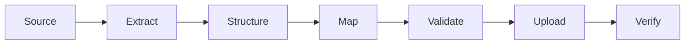

# Create Verified Hevy Routines from a Training Program

Use this guide to convert a PDF, spreadsheet, or written program into organized Hevy routines through the public API. It focuses on accuracy, clean in-app instructions, safe recovery, and reproducible verification.



> Check the current Hevy API documentation before every project. Never store an API key in shared instructions, payloads, screenshots, or source control. Rotate an exposed key.

## 1. Create a source of truth

Extract the entire program into Markdown or structured JSON before calling the API. Preserve the order and meaning of every table row, including exercise identity, sets, target ranges, rest, effort, warm-ups, techniques, cues, and substitutions when present.

Resolve broken characters, merged cells, footnotes, and ambiguous ranges against the original document. Record anything that cannot be resolved instead of guessing. This canonical file becomes the authority for all generated data.

## 2. Design a readable routine structure

Compare consecutive weeks by their actual prescriptions. Combine weeks only when all relevant values are identical; create a new phase when any required value changes.

Use one top-level folder per distinct phase and one routine per training day. Because nested folders may not be available, use concise folder names and numeric routine prefixes to make display order predictable:

```text
Program - Phase 01
  01 <Training Day>
  02 <Training Day>
```

## 3. Map exercises explicitly

Fetch every available exercise template and create a reviewed mapping table. Each source exercise should map to exactly one verified template ID, with the selected title, type, equipment, and a brief reason for the choice.

Match movement pattern and equipment rather than wording alone. If no acceptable template exists, either document an approved approximation or create a custom template. Re-fetch custom templates and verify their IDs and metadata before using them.

## 4. Generate immutable payloads

Create one JSON request per routine. Use placeholders until the intended folder has a verified live ID:

```json
{
  "routine": {
    "title": "<Routine Title>",
    "folder_id": "<Verified Folder ID>",
    "exercises": [
      {
        "exercise_template_id": "<Verified Template ID>",
        "superset_id": null,
        "rest_seconds": "<Timer>",
        "notes": "<Concise instructions from the source>",
        "sets": [
          {
            "type": "<Valid Set Type>",
            "weight_kg": null,
            "reps": null,
            "rep_range": {
              "start": "<Minimum>",
              "end": "<Maximum>"
            }
          }
        ]
      }
    ]
  }
}
```

Preserve exercise order and set count exactly. Do not infer special set types that the source does not prescribe. When the API requires one value for a source range, define one consistent conversion rule and retain the original range where it helps the user.

Keep in-app descriptions short and actionable. Remove schedules, generic reminders, redundant titles, external links, and empty labels. Include only information needed while performing the exercise. Use plain ASCII if testing shows that special characters are normalized.

## 5. Run a read-only preflight

Before writing, fetch the authenticated user, folders, routines, and exercise templates. Save complete before-state snapshots and confirm:

- the authenticated account is correct;
- target names will not collide with existing objects;
- every template ID exists and matches the mapping;
- all payloads use the current request schema;
- routine, exercise, and set totals match the canonical plan;
- set types, ranges, timers, and required fields are valid.

Create SHA-256 hashes for the source, mapping, and payload files. Reject any payload that changes after approval.

## 6. Upload with checkpoints

Create folders first, insert their verified IDs into the routine requests, and then create routines. If new folders appear at the top of Hevy, create them in reverse display order.

After each successful write:

1. save the returned or reconciled object ID to a manifest;
2. read the object back from Hevy;
3. compare it field-by-field with the approved request;
4. continue only after the comparison passes.

Compare titles, folder membership, exercise order, template IDs, notes, timers, supersets, set counts, set types, and target ranges.

If a request times out or returns an unexpected response, do not retry blindly. Re-list the account, identify any new object by ID and exact content, update the manifest, and resume only after proving what exists. A safe resume must reject unknown target objects to prevent duplicates.

## 7. Verify the final state

Fetch all folders and routines again. Confirm the expected structure, unique IDs, exact totals, and equality between every live routine and its approved payload. Compare the before and after snapshots to prove that pre-existing objects did not change.

Store the source, mappings, payloads, hashes, manifests, API snapshots, and a compact result summary in a dated audit directory. For high-confidence projects, use independent reviews for:

1. source-to-payload fidelity;
2. API schema and template validity;
3. payload-to-live equality.

The project is complete only when:

```text
Original source = Approved payloads = Live Hevy routines
```

Rotate the upload API key after completion.

## References

- [Hevy Public API documentation](https://api.hevyapp.com/docs/) — endpoints, schemas, and allowed values.
- [Hevy developer settings](https://hevy.com/settings?developer) — obtain or rotate an API key after signing in; access may require Hevy Pro.
- [PowerShell `Invoke-RestMethod`](https://learn.microsoft.com/en-us/powershell/module/microsoft.powershell.utility/invoke-restmethod) — send REST requests.
- [PowerShell `ConvertTo-Json`](https://learn.microsoft.com/en-us/powershell/module/microsoft.powershell.utility/convertto-json) and [`ConvertFrom-Json`](https://learn.microsoft.com/en-us/powershell/module/microsoft.powershell.utility/convertfrom-json) — handle JSON data.
- [PowerShell `Get-FileHash`](https://learn.microsoft.com/en-us/powershell/module/microsoft.powershell.utility/get-filehash) — generate SHA-256 integrity checks.
- [OpenAPI Specification](https://spec.openapis.org/oas/v3.0.4.html) — understand the schema shown by Swagger UI.
