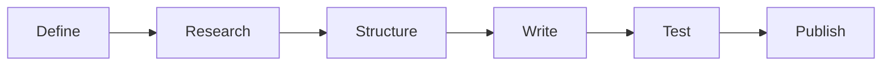

# Create Reusable Agent-Instruction Markdown

Use this guide to write instructions that another LLM agent—or a person supervising one—can follow later without relying on the original conversation.



## 1. Define the contract

Start with one sentence describing the outcome. Then state what is in scope, what is out of scope, required inputs, produced artifacts, and actions that require approval. Replace hidden assumptions with explicit rules.

Write for a capable reader who has no access to the conversation that produced the document.

## 2. Establish authoritative sources

Identify which files, documentation, schemas, or systems are authoritative. Distinguish source facts from derived decisions. If information can change, tell the agent to verify it before acting and link the primary source in the references section.

Never embed credentials, personal identifiers, private URLs, or confidential examples. Use clearly named placeholders.

## 3. Show the workflow early

Place a small dataflow or sequence diagram near the top when it makes the process easier to understand. Keep it to the major stages; explain edge cases in prose.

Organize the body in execution order. Each step should explain:

- what the agent is trying to achieve;
- what information it uses;
- the decision rule it applies;
- what artifact or verified state it produces.

Use examples only when they clarify structure. Make them obviously generic and avoid copying real project data.

## 4. Add safety and recovery rules

Separate read-only inspection from state-changing actions. Define checks that must pass before writes, the exact scope of allowed changes, and how the agent should behave after partial success, timeouts, or ambiguous responses.

For external systems, require durable manifests or checkpoints after each successful write. Prefer reconciliation over blind retries. Explain when the agent must stop and request human direction.

## 5. Define verification and completion

Use measurable acceptance criteria. Examples include expected object counts, schema validation, hash equality, before-and-after comparisons, or an independent review. State that a task is complete only when required outputs exist and all checks pass.

Avoid vague endings such as “confirm everything looks correct.” Name the fields, artifacts, or behaviors that must match.

## 6. Edit for people

Keep headings descriptive, paragraphs short, and lists purposeful. Lead with the outcome, then add the minimum detail needed to act safely. Move long references and optional background to the end. Remove duplicated rules, decorative complexity, and implementation details that do not change a decision.

A strong instruction document should answer:

1. What are we producing?
2. What inputs are authoritative?
3. What sequence should the agent follow?
4. What can change external state?
5. How are failures recovered?
6. How is success proven?

## 7. Test before publishing

Have a fresh reader or agent follow the document without the original conversation. Record ambiguous steps, missing inputs, unsafe assumptions, and unverifiable acceptance criteria. Revise, test links, confirm that examples are sanitized, and commit the result with a message explaining the change.

## Recommended template

```text
# Outcome-focused title

Purpose and scope

Minimal workflow diagram

## Inputs and source of truth
## Structure or data model
## Step-by-step workflow
## Safety and recovery
## Verification and acceptance
## References
```

## References

- [GitHub: Basic writing and formatting syntax](https://docs.github.com/en/get-started/writing-on-github/getting-started-with-writing-and-formatting-on-github/basic-writing-and-formatting-syntax)
- [GitHub: Creating diagrams with Mermaid](https://docs.github.com/en/get-started/writing-on-github/working-with-advanced-formatting/creating-diagrams)
- [CommonMark specification](https://spec.commonmark.org/)
