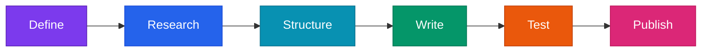

<div align="center">

# 🤖 Agent First

### Reusable instructions for reliable, reproducible LLM workflows

[](#instruction-library)
[](#quick-start)
[](#repository-standards)
[](#4-design-for-safety-and-recovery)

*A version-controlled home for instructions that agents and people can understand, run, verify, and improve.*

</div>

> [!IMPORTANT]
> This repository stores **how work should be performed**. Keep credentials, private source material, generated payloads, and API responses outside the repository unless they have been intentionally sanitized.

## Instruction library

| Area | Instruction | What it helps an agent do |
|---|---|---|
| 🏋️ Hevy | [Create verified Hevy routines from a training program](./HEVY/) | Convert a source program into clean, mapped, validated, and live-verified Hevy routines. |

As the library grows, add one folder per system or workflow and use descriptive lowercase filenames with hyphens.

## Quick start

1. Open the instruction closest to your task.
2. Read its required inputs, safety gates, and acceptance criteria.
3. Give the document to the agent as task context or reference it directly.
4. Replace placeholders with project-specific values outside the shared instruction.
5. Confirm that linked APIs, schemas, and external requirements are current.
6. Save run evidence separately so the result can be reproduced and audited.

---

## Create reusable agent instructions

Use the following framework when adding a new Markdown instruction to this repository.



### 1. Define the contract

Start with one sentence describing the outcome. State what is in scope, what is out of scope, required inputs, produced artifacts, and actions that require approval. Replace hidden assumptions with explicit rules.

Write for a capable reader who has no access to the conversation that produced the document.

### 2. Establish authoritative sources

Identify the files, documentation, schemas, or systems that are authoritative. Separate source facts from derived decisions. If information can change, require the agent to verify it before acting and link the primary source in a final references section.

Never embed credentials, personal identifiers, private URLs, or confidential examples. Use clearly named placeholders.

### 3. Make the workflow visible

Add a small dataflow or sequence diagram near the top when it materially improves understanding. Keep it to major stages and explain edge cases in prose.

Organize steps in execution order. Each step should make four things clear:

- **Goal:** what state the agent is trying to reach;
- **Inputs:** what information it uses;
- **Decision:** what rule it applies;
- **Evidence:** what artifact or verified state it produces.

Use examples only when they clarify structure. Keep them generic and visibly separate from real project data.

### 4. Design for safety and recovery

Separate read-only inspection from state-changing actions. Define the checks that must pass before writes, the exact scope of allowed changes, and the behavior required after partial success, timeouts, or ambiguous responses.

For external systems, use durable manifests or checkpoints after each successful write. Prefer reconciliation over blind retries. State when the agent must stop and request human direction.

### 5. Prove completion

Use measurable acceptance criteria: expected artifacts, schema validation, hash equality, before-and-after comparisons, tests, or independent review. A task is complete only when every required output exists and every required check passes.

Avoid vague endings such as “confirm everything looks correct.” Name the fields, files, counts, or behaviors that must match.

### 6. Edit for people

Lead with the outcome. Keep headings descriptive, paragraphs short, and lists purposeful. Put essential instructions in the main path and optional background at the end. Remove duplicated rules and implementation detail that does not affect a decision.

A strong document answers:

1. What are we producing?
2. Which inputs are authoritative?
3. What sequence should the agent follow?
4. Which steps can change external state?
5. How are partial failures recovered?
6. How is success proven?

### 7. Test before publishing

Have a fresh reader or agent follow the instruction without the original conversation. Record ambiguous steps, missing inputs, unsafe assumptions, and unverifiable acceptance criteria. Revise, test all links, confirm that examples are sanitized, and commit with a message explaining what changed.

## Starter template

```markdown
# Outcome-focused title

One-paragraph purpose, scope, and important warning.

Minimal workflow diagram, when useful.

## Inputs and source of truth
## Structure or data model
## Step-by-step workflow
## Safety and recovery
## Verification and acceptance
## References
```

## Repository standards

Every instruction should be:

- 🎯 **Outcome-focused** — one concrete objective and clear boundaries;
- 📚 **Source-grounded** — authoritative inputs and current primary references;
- 🔁 **Deterministic** — explicit steps, mappings, and decision rules;
- 🛡️ **Safe** — read-only checks before writes, scoped authority, and recovery behavior;
- ✅ **Verifiable** — measurable acceptance criteria and retained evidence;
- 🔐 **Sanitized** — no secrets, personal data, or private project content;
- 👀 **Readable** — concise prose, useful visuals, and references at the end.

Use Git history to document meaningful changes. When an API or dependency changes, update the relevant instruction and record what was revalidated.

## Repository layout

```text
agent-first/
  README.md
  HEVY/
    README.md
```

## References

- [GitHub: Basic writing and formatting syntax](https://docs.github.com/en/get-started/writing-on-github/getting-started-with-writing-and-formatting-on-github/basic-writing-and-formatting-syntax)
- [GitHub: Creating diagrams with Mermaid](https://docs.github.com/en/get-started/writing-on-github/working-with-advanced-formatting/creating-diagrams)
- [GitHub: About task lists](https://docs.github.com/en/get-started/writing-on-github/working-with-advanced-formatting/about-task-lists)
- [CommonMark specification](https://spec.commonmark.org/)
